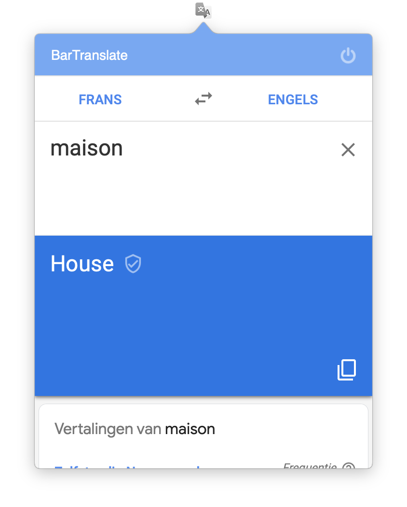

# BarTranslate for MacOS (BETA)
BarTranslate is a handy menu bar translator widget for MacOS.

Translations are done by presenting a simple (altered) webview of translate.google.com in a quick and easily accessible interface.

# Future features
* Settings page, including:
  * Option to set default source and target languages
  * Option to change interface language
  * Option to set custom frame size (small, medium, large)
  * Option to enable/disable top bar
  * Option to set font size of text boxes

# Extra information
* BarTranslate version 0.1 (BETA)
* BarTranslate is still in development, meaning that a) minor issues may arise and b) its functionality is not (yet) as extensive as I plan to.
* MacOS Sierra (10.12) or above is required.
