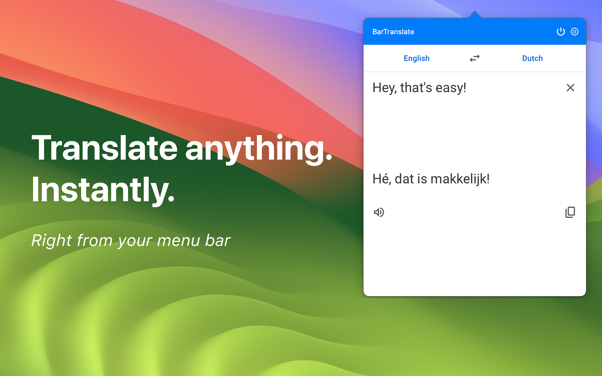

# BarTranslate

🚀 A handy (free) menu bar translator widget for macOS.

<p align="center">
    
    <br/>
    
</p>

Translations are done by presenting a simple (altered) webview of **Google Translate** in a quick and easily accessible interface.

## Installation (App Store)

By downloading BarTranslate from the App Store, you support the project with a small fee. In addition, you get:

**Automatic updates**. Always run the latest version.

**Apple notarization**. The App Store version is verified by Apple, so no Gatekeeper warnings or "unidentified developer" prompts. 

<a href="https://apps.apple.com/nl/app/bartranslate/id6759278154">
    
</a>


## Installation (Homebrew)

This fork is distributed with a fork-specific Homebrew cask so it can coexist with upstream BarTranslate:

```sh
brew tap acoliver/tap
brew install --cask bartranslate-aco
```

The cask installs `BarTranslateACO.app`.

## Installation (manual)

1. Refer to the [latest releases](https://github.com/acoliver/BarTranslate/releases).
2. Download `bartranslate-aco-vX.Y.Z-universal-apple-darwin.zip`.
3. Unzip the file.
4. Place `BarTranslateACO.app` in your Applications folder.
5. Run `BarTranslateACO.app`.
6. Happy translating!

Release maintainers should see [docs/release.md](docs/release.md) for signing, notarization, and Homebrew tap secrets.


Feel free to [share your ideas](https://github.com/ThijmenDam/BarTranslate/discussions)!

* Translations are done by presenting a simple (altered) webview of **Google Translate** in a quick and easily accessible interface.
* Configurable hotkeys to toggle the app.
* Smart autofocus on the source text field when opening the app.

### Planned

* Dark mode for the translation pages.
* Configurable hotkeys to select/swap languages.
* Configurable hotkey to directly translate clipboard content.

## Support the author

Enjoying BarTranslate? Grab it on the [App Store](https://apps.apple.com/nl/app/bartranslate/id6759278154) to support continued development!
