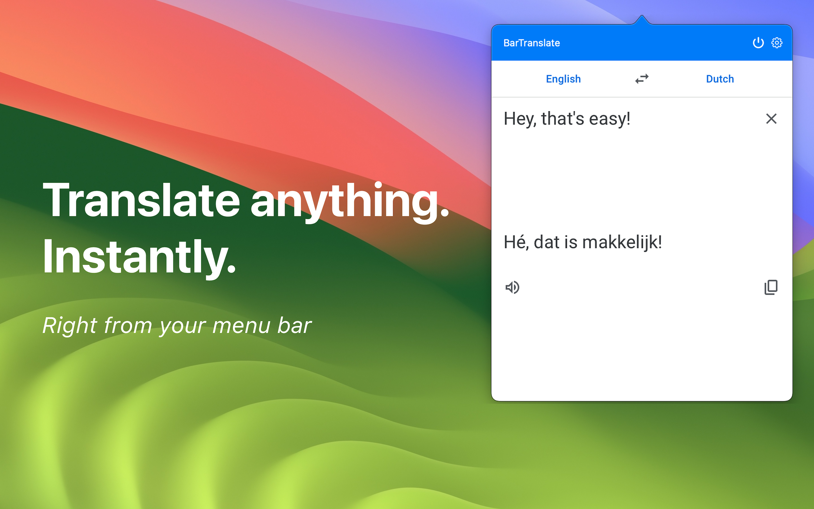
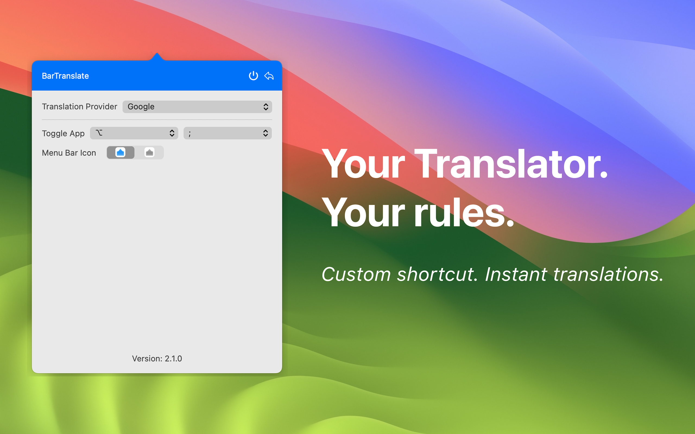

# BarTranslate

🚀 A handy (free) menu bar translator widget for macOS.

    
     
    

Translations are done by presenting a simple (altered) webview of **Google Translate** in a quick and easily accessible interface.

## Installation (App Store)

By downloading BarTranslate from the App Store, you support the project with a small fee. In addition, you get:

**Automatic updates**. Always run the latest version.

**Apple notarization**. The App Store version is verified by Apple, so no Gatekeeper warnings or "unidentified developer" prompts.

## Installation (manual)

1. Refer to the [latest releases](https://github.com/ThijmenDam/BarTranslate/releases).
2. Download BarTranslate.zip.
3. Unzip the file.
4. Place BarTranslate.app in your Applications folder.
5. Run BarTranslate.app.
6. Happy translating!

## Features

Feel free to [share your ideas](https://github.com/ThijmenDam/BarTranslate/discussions)!

- Translations are done by presenting a simple (altered) webview of **Google Translate** in a quick and easily accessible interface.
- Configurable hotkeys to toggle the app.
- Smart autofocus on the source text field when opening the app.
- Configurable "Quick Translate" hotkey: instantly translates whatever's on your clipboard.
- Dark mode setting (System, Light, or Dark) for the app and the translation pages.

### Planned

- Configurable hotkeys to select/swap languages.
- Moveable BarTranslate panel that you can pin anywhere on your screen.

## Support the author

Enjoying BarTranslate? Grab it on the [App Store](https://apps.apple.com/nl/app/bartranslate/id6759278154) to support continued development!
