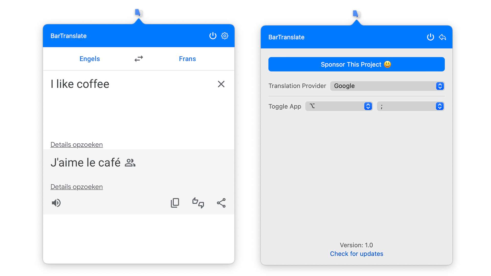

<link rel="stylesheet" href="assets/css/style.css">

    

Translations are done by presenting a simple (altered) webview of your preferred translation provider in a quick and easily accessible interface.

Included support for **Google Translate** and **DeepL Translate**.

## Download

1. Refer to the [latest releases](https://github.com/ThijmenDam/BarTranslate/releases).
2. Download BarTranslate.zip.
3. Unzip the file.
4. Place BarTranslate.app in your Applications folder.
5. Run BarTranslate.app.
6. Happy translating!

## Features

Feel free to [share your ideas](https://github.com/ThijmenDam/BarTranslate/discussions)!

- A quick and easily accessible menu bar application for your preferred translation provider:
  - Google Translate.
  - DeepL Translate.
- Configurable hotkeys to toggle the app.

### Planned

- Dark mode for the translation pages.
- Configurable hotkeys to select/swap languages.
- Smart autofocus on the source text field when opening the app.
- Automatically update the app when a new version is released.

## Support the author

Like my work? [Consider buying me a coffee!](https://github.com/sponsors/ThijmenDam)
