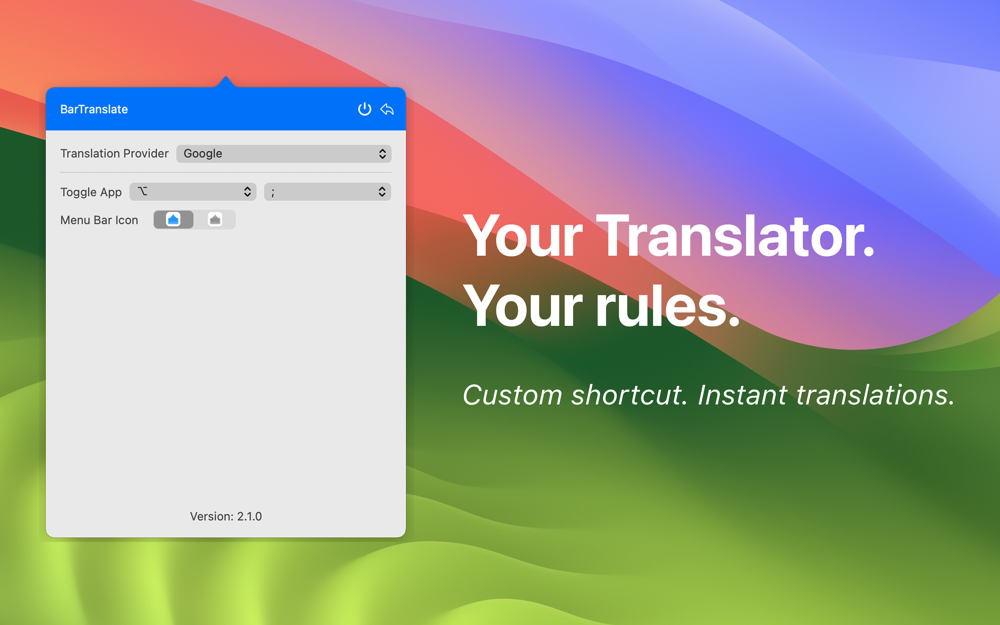

<link rel="stylesheet" href="assets/css/style.css">

    
     
    

Translations are done by presenting a simple (altered) webview of **Google Translate** in a quick and easily accessible interface.

## Download

1. Refer to the [latest releases](https://github.com/ThijmenDam/BarTranslate/releases).
2. Download BarTranslate.zip.
3. Unzip the file.
4. Place BarTranslate.app in your Applications folder.
5. Run BarTranslate.app.
6. Happy translating!

## Features

Feel free to [share your ideas](https://github.com/ThijmenDam/BarTranslate/discussions)!

- Translations are done by presenting a simple (altered) webview of **Google Translate** in a quick and easily accessible interface.
- Configurable hotkeys to toggle the app.
- Smart autofocus on the source text field when opening the app.

### Planned

- Dark mode for the translation pages.
- Configurable hotkeys to select/swap languages.
- Automatically update the app when a new version is released.
- Configurable hotkey to directly translate clipboard content.

## Support the author

Like my work? [Consider buying me a coffee!](https://github.com/sponsors/ThijmenDam)
